# CreativeHub — 创意作品展示平台

华中师范大学《Web 程序设计》课程设计项目。一个面向数字媒体技术专业学生的创意作品展示与社区交流平台，类似 Behance（作品展示）+ 小红书（社区互动）的校园版。

## 技术栈

| 类别 | 技术 | 版本 |
|------|------|------|
| 前端框架 | Vue 3 (Composition API) | 3.4.x |
| 构建工具 | Vite | 5.x |
| 路由 | Vue Router | 4.x |
| 状态管理 | Pinia + persist 插件 | 2.x |
| HTTP | axios | 1.x |
| UI 组件库 | Element Plus | 2.x |
| 模拟数据 | Mock.js | latest |

纯前端 SPA 应用，无需后端服务器。

---

## 快速开始

### 环境要求
- **Node.js** ≥ 18.x  
- **npm** ≥ 9.x

### 安装与运行

```bash
# 1. 进入项目目录
cd creativehub

# 2. 安装依赖
npm install

# 3. 启动开发服务器
npm run dev
```

浏览器打开 **http://localhost:5173** 即可访问。

### 生产构建

```bash
npm run build    # 构建到 dist/ 目录
npm run preview  # 预览构建结果
```

---

## 测试账号

密码统一为 **`123456`**

| 邮箱 | 昵称 | 身份 |
|------|------|------|
| `wang@test.com` | 设计师小王 | UI/UX 设计师（数据最丰富，推荐首选） |
| `li@test.com` | 插画师小李 | 自由插画师 |
| `zhang@test.com` | 摄影师小张 | 风光摄影师 |
| `chen@test.com` | 三维设计师小陈 | 3D 艺术家 |
| `liu@test.com` | 视频达人小刘 | 微电影导演 |
| `zhao@test.com` | 平面设计师小赵 | 品牌设计师 |
| `zhou@test.com` | 动效设计师小周 | Motion Graphics 设计师 |
| `lin@test.com` | 概念艺术家小林 | 概念设计 |
| `wu@test.com` | 新锐设计师小吴 | 数媒大三学生 |
| `zheng@test.com` | 设计爱好者小郑 | 设计初学者 |

> 每个账号都有预设的作品、统计数据，可用于测试不同角色视角。

---

## 推荐测试流程

1. **浏览前台**：打开首页 → 查看瀑布流作品 → 切换排序（最新/最热/推荐）
2. **查看详情**：点击作品卡片 → 图片轮播 → 点击全屏查看
3. **登录体验**：用 `wang@test.com` / `123456` 登录
4. **社区互动**：在作品详情页点赞、收藏、发表评论
5. **创作者中心**：进入仪表盘 → 上传新作品 → 管理已有作品 → 草稿箱
6. **跨账号测试**：换 `li@test.com` 登录 → 关注设计师小王 → 查看关注动态

---

## 项目结构

```
creativehub/
├── public/
│   └── favicon.svg
├── src/
│   ├── api/                    # API 接口封装
│   │   ├── request.js          # axios 实例 + 拦截器
│   │   ├── work.js             # 作品相关接口
│   │   ├── user.js             # 用户相关接口
│   │   └── interaction.js      # 互动相关接口
│   │
│   ├── assets/styles/
│   │   └── main.css            # 全局样式 + CSS 变量
│   │
│   ├── components/             # 公共组件（10 个）
│   │   ├── Header.vue          # 顶部导航（含移动端菜单）
│   │   ├── Footer.vue          # 底部信息
│   │   ├── WorkCard.vue        # 作品卡片
│   │   ├── WorkList.vue        # 作品瀑布流列表
│   │   ├── UserCard.vue        # 用户卡片
│   │   ├── CategoryNav.vue     # 分类导航
│   │   ├── TagCloud.vue        # 标签云
│   │   ├── CommentList.vue     # 评论列表 + 发表
│   │   ├── AdminLayout.vue     # 后台通用布局
│   │   └── BackToTop.vue       # 回到顶部
│   │
│   ├── views/
│   │   ├── frontend/           # 前台页面（8 个）
│   │   │   ├── Home.vue        # 首页 — 瀑布流
│   │   │   ├── WorkDetail.vue  # 作品详情 — 轮播 + 互动
│   │   │   ├── Category.vue    # 分类浏览
│   │   │   ├── Tag.vue         # 标签筛选
│   │   │   ├── Search.vue      # 搜索 (作品/用户)
│   │   │   ├── UserProfile.vue # 用户主页
│   │   │   ├── Ranking.vue     # 排行榜
│   │   │   └── About.vue       # 关于平台
│   │   │
│   │   └── backend/            # 后台页面（7 个）
│   │       ├── Login.vue       # 登录/注册
│   │       ├── Dashboard.vue   # 仪表盘
│   │       ├── WorkManage.vue  # 作品管理
│   │       ├── WorkUpload.vue  # 上传作品
│   │       ├── WorkEdit.vue    # 编辑作品
│   │       ├── Draft.vue       # 草稿箱
│   │       └── Settings.vue    # 个人设置
│   │
│   ├── stores/                 # Pinia 状态管理
│   │   ├── index.js
│   │   ├── workStore.js        # 作品管理
│   │   ├── userStore.js        # 用户管理（含登录持久化）
│   │   ├── categoryStore.js    # 分类 & 标签
│   │   └── interactionStore.js # 点赞/收藏/评论/关注
│   │
│   ├── router/
│   │   └── index.js            # 15 条路由 + 路由守卫
│   │
│   ├── mock/
│   │   └── index.js            # Mock.js 种子数据 + API 拦截
│   │
│   ├── utils/
│   │   ├── storage.js          # localStorage 封装
│   │   ├── date.js             # 日期格式化 & 相对时间
│   │   ├── validate.js         # 表单验证规则
│   │   └── debounce.js         # 防抖 & 节流
│   │
│   ├── App.vue                 # 根组件（页面过渡动画）
│   └── main.js                 # 入口文件
│
├── index.html
├── vite.config.js
└── package.json
```

## 功能清单

### 前台（公开访问）
- 首页瀑布流展示 + 排序切换（最新/最热/推荐）
- 分类快捷入口（6 个预设分类）
- 作品详情页（图片轮播 + 全屏查看）
- 标签云 + 标签筛选
- 搜索（作品 / 用户 Tab 切换）
- 用户主页（信息卡片 + 统计 + 作品集）
- 热门排行榜（作品 / 创作者）
- 响应式适配（桌面 / 平板 / 手机）

### 社交互动（登录后）
- 点赞 / 取消点赞
- 收藏 / 取消收藏
- 发表评论 + 查看评论列表
- 关注 / 取消关注

### 创作者中心（登录后）
- 数据仪表盘（作品数 / 浏览量 / 获赞 / 粉丝）
- 上传作品（标题、描述、分类、标签、多图 → Base64）
- 作品管理（表格 + 搜索/筛选/排序/分页 + 编辑/删除）
- 草稿箱（编辑/发布/删除）
- 个人设置（修改资料 / 密码）

---

## 项目截图

> 截图请放入 `screenshots/` 文件夹，按编号命名替换下方占位即可。

### 前台页面

| 截图 | 说明 |
|------|------|
| 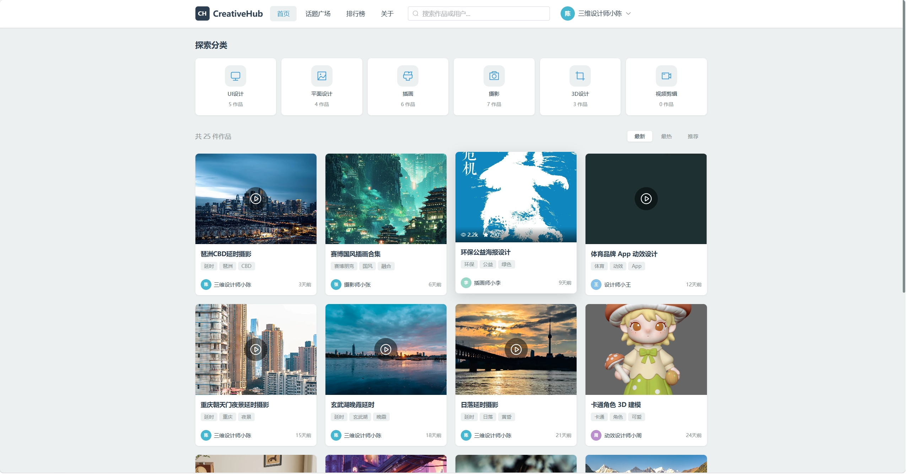 | **首页** — 分类入口 + 作品瀑布流 |
| 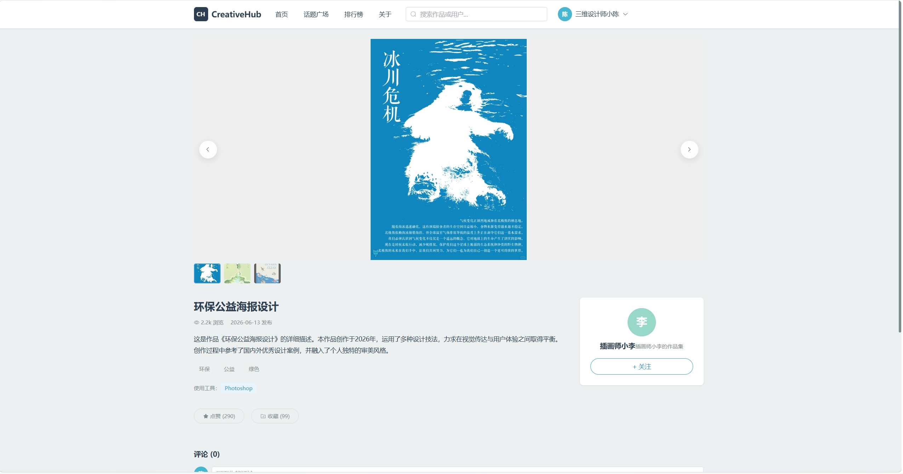 | **作品详情** — 图片轮播 + 互动区 |
| 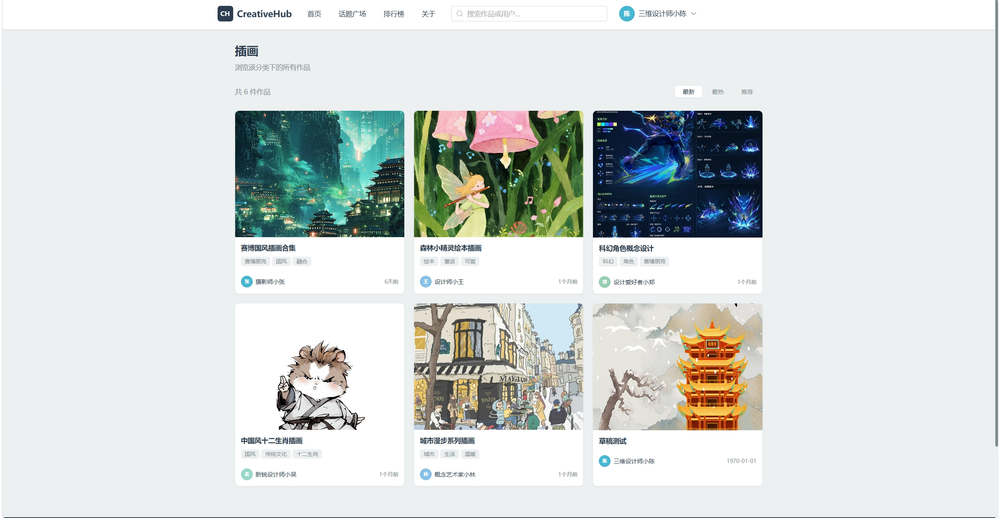 | **分类浏览** — 按分类筛选作品 |
| 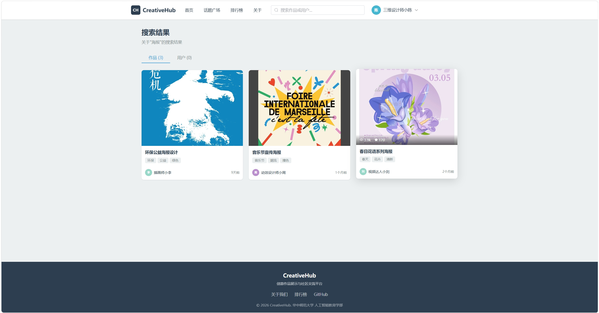 | **搜索** — 作品/用户 Tab 切换 |
| 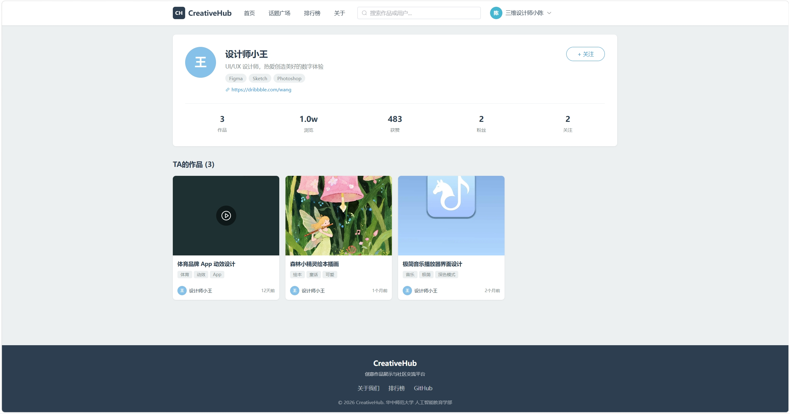 | **用户主页** — 信息卡片 + 作品集 |
| 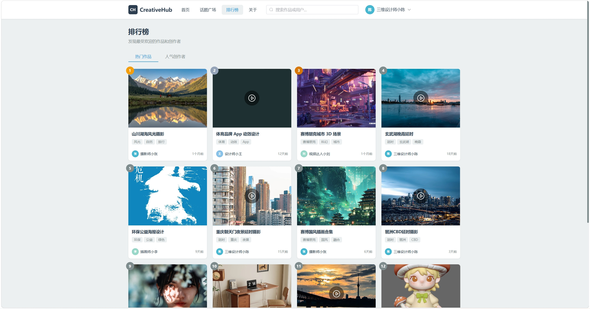 | **排行榜** — 热门作品 / 人气创作者 |
| 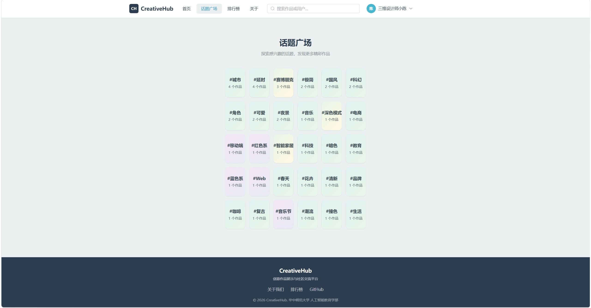 | **话题广场** — 标签聚合卡片 |
| 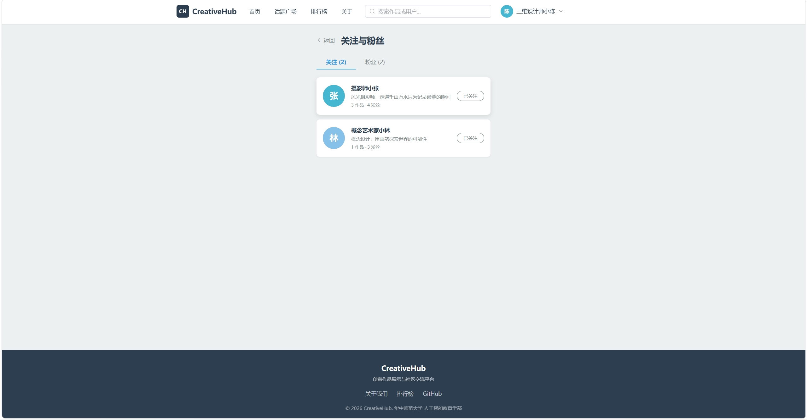 | **关注与粉丝** — 关注列表 |

### 创作者中心

| 截图 | 说明 |
|------|------|
| 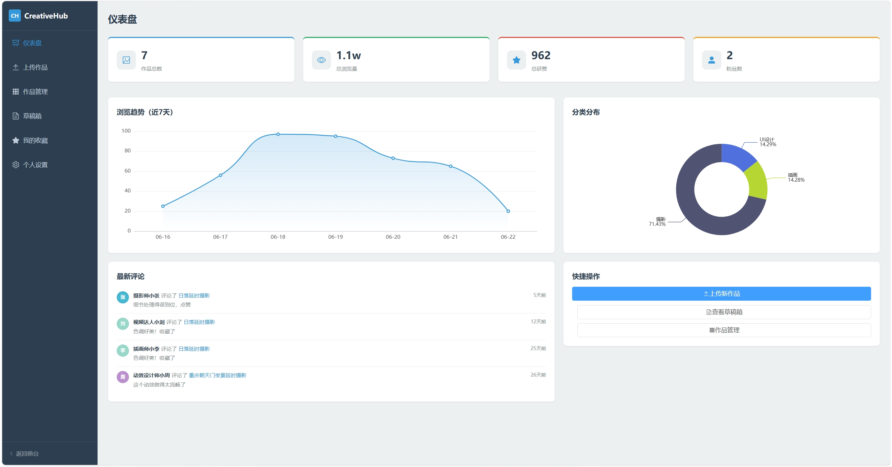 | **仪表盘** — 数据统计 + 图表 + 最新评论 |
| 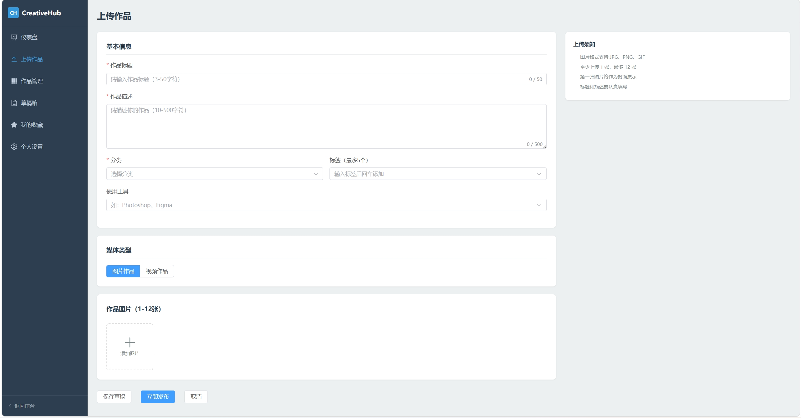 | **上传作品** — 表单 + 图片/视频切换 |
| 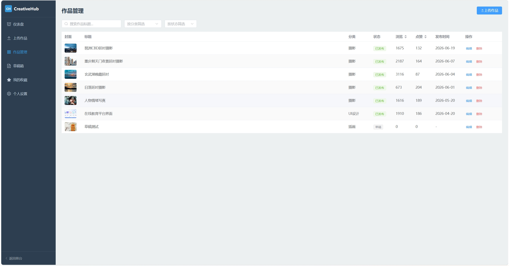 | **作品管理** — 表格 + 搜索筛选 |
| 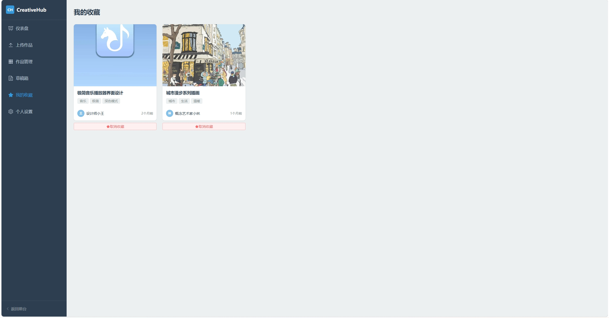 | **我的收藏** — 收藏作品列表 |

> 📸 共需 **12 张**截图，按上表命名放入 `screenshots/` 文件夹后提交即自动显示。

---

## 项目文档

项目根目录 `docs/` 下有完整标准文档：
- [需求分析](../docs/requirements.md)
- [技术规范](../docs/tech-spec.md)
- [设计规范](../docs/design-spec.md)
- [执行计划](../docs/execution-plan.md)

课程设计原始要求见 [课程设计.md](../md/课程设计.md)

---

## License

MIT — 本项目为课程设计作业
